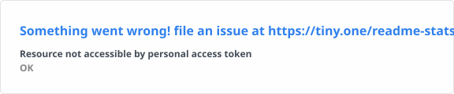

<h1 align='center' >🔥 Hackernese 🔥</h1>

I am a Penetration Tester, a Fullstack developer, an IoT enthusiast and possibly a researcher soon...

### Development skills

    
    
    
    
    
    
    
    
    
    
    
    
    
    
    
    
    
    
    
    
    
    
    
    
    
    
    
    
    
    
    
    
    
    
    
    
    
    
    
        

 

### Security skills 

        
        
        
        
        
        
        
        
        
        
        
        
        
        
        
        
        
        
        
        
        
        
        
        

 

### Github stats

<!-- 

&nbsp;
 -->

